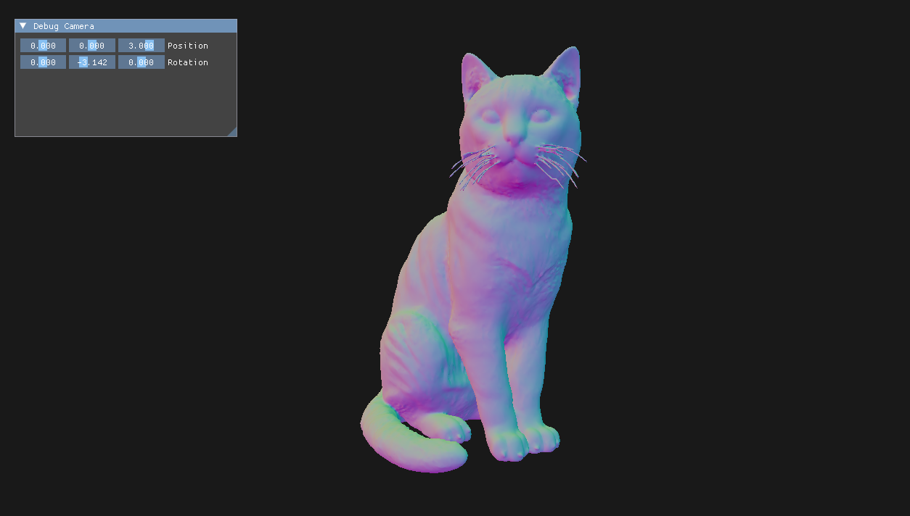

# Vectrix
[](LICENSE)
[]()

An engine made to run all of my little graphics project



## Features
 - Vulkan powered rendering
 - OBJ Model Loading
 - Runtime shader compilation

## Prerequisites
- [CMake 3.21.7](https://cmake.org/download/)
- [Lunar Vulkan SDK >=1.4.335.0](https://vulkan.lunarg.com/sdk/home)
- [Python 3](https://www.python.org/downloads/)
- Window 10/11 or Linux (Ubuntu and PopOs were the only distros tested)

## Installation
```bash
# Clone the repository
git clone --recurse-submodules https://github.com/RX0kas/VectrixEngine.git
cd VectrixEngine
mkdir build
cmake -S . -B ./build
cmake --build ./build
cd run
..\build\bin\Your_Platform\Debug\Sandbox.exe
```

## How to use
### CMakeLists.txt
```cmake
# Include your source
file(GLOB_RECURSE PROJECT_SOURCES
        Project/src/*.cpp
        Project/src/*.h
)

add_executable(Project ${PROJECT_SOURCES})

# Link your project with Vectrix
target_link_libraries(Project PRIVATE Vectrix)
target_include_directories(Project PRIVATE
        $<TARGET_PROPERTY:Vectrix,INTERFACE_INCLUDE_DIRECTORIES>
)
target_compile_definitions(Project PRIVATE
        $<TARGET_PROPERTY:Vectrix,INTERFACE_COMPILE_DEFINITIONS>
)

if(MSVC)
    target_compile_options(Project PRIVATE /utf-8)
endif()
```
#### main.cpp
```c++
// Include the entry point
#include <Vectrix.h>
```
## Documentation

- [API Documentation (TODO)]()


## Roadmap

- [x] Clearly separate the Vulkan part from the rest of the engine
- [x] Make a universal function for sending shader uniform
- [ ] Refactor to have the same naming convention everywhere and add better comments
- [ ] Create the API documentation
- [ ] Find a better way to deal with the ImGuiLayer
- [ ] Add a material system
- [ ] Add an editor

## Known Issues

- Multi-Viewport is disabled on Linux due to numerous compatibility issues

## Acknowledgments

- Thanks to [TheCherno](https://github.com/TheCherno) for the API inspiration
- [Dear ImGui](https://github.com/ocornut/imgui) for the ui library
- [spdlog](https://github.com/gabime/spdlog) for the logging library

---

If you like this project, feel free to give it a star!
