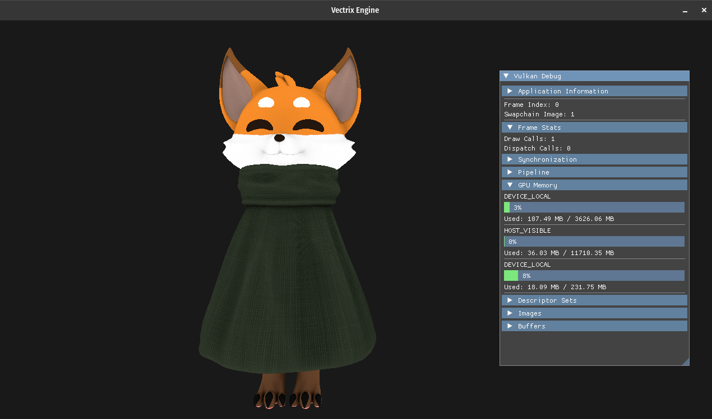

# Vectrix
[](LICENSE)


An engine made to run all of my little graphics project

Current Working branch: [feature/profiling](https://github.com/RX0kas/VectrixEngine/tree/feature/profiling)



## Features
 - Vulkan powered rendering
 - OBJ Model Loading
 - Runtime shader compilation

## Prerequisites
- [CMake 3.20](https://cmake.org/download/)
- [Lunar Vulkan SDK >=1.4.335.0](https://vulkan.lunarg.com/sdk/home)
- [Python 3](https://www.python.org/downloads/)
- Window 10/11 or Linux (Ubuntu and PopOs were the only distros tested)

## Installation
```bash
git clone --recurse-submodules https://github.com/RX0kas/VectrixEngine.git
cd VectrixEngine
mkdir build
cmake -S . -B ./build
cmake --build ./build
cd run
..\build\bin\Your_Platform\Debug\Sandbox.exe
```

## How to use
You can see the [Sandbox](https://github.com/RX0kas/VectrixEngine/tree/master/Sandbox/src) to better understand
#### CMakeLists.txt
```cmake
# Include your source
file(GLOB_RECURSE PROJECT_SOURCES
    Project/src/*.cpp
    Project/src/*.h
)

add_executable(Project ${PROJECT_SOURCES})

# Link your project with Vectrix
add_subdirectory(extern/VectrixEngine)

target_link_libraries(Project PRIVATE Vectrix)
target_include_directories(Project PRIVATE
    $<TARGET_PROPERTY:Vectrix,INTERFACE_INCLUDE_DIRECTORIES>
)
target_compile_definitions(Project PRIVATE
    $<TARGET_PROPERTY:Vectrix,INTERFACE_COMPILE_DEFINITIONS>
)

if(MSVC)
    target_compile_options(Project PRIVATE /utf-8)
endif()
```
#### main.cpp
```c++
// Include the entry point
#include <Vectrix.h>
// Create a custom layer
class CustomLayer : public Vectrix::Layer
{
public:
    CustomLayer() : Layer("Example") {
        // Load a model and texture
        m_model = std::make_unique<Vectrix::Model>(Vectrix::Model::load("./mymodel.obj"));
        Vectrix::TextureManager::instance().createTexture("mainT","./mytexture.png");
        // Create a layout for the main shader
        Vectrix::ShaderUniformLayout layout;
        layout.add("time",Vectrix::ShaderUniformType::Float);
        // Create the shader and tell it how to load Obj Files
        Vectrix::ShaderManager::createShader("main", "./main.vert", "./main.frag",layout, Vectrix::getTinyObjLayout(),true);
        // Save the shader in a variable
        m_main = Vectrix::ShaderManager::instance().get("main");
        m_texture = Vectrix::TextureManager::instance().get("mainT");
    }

    // Do something each frame
    void OnUpdate(const Vectrix::DeltaTime& dt) override
    {
        m_cameraController.onUpdate(dt);
    }

    // Same but for rendering stuff
    void OnRender() override {
        // Tell the renderer to start rendering a scene
        Vectrix::Renderer::beginScene(m_cameraController.getCamera());
        // Set the texture
        m_main->setTexture(0,m_texture);
        // Tell to draw the model
        Vectrix::Renderer::submit(*m_main.get(),*m_model);
        // Send the frame
        Vectrix::Renderer::endScene();
    }

    void OnEvent(Vectrix::Event &event) override {
        m_cameraController.onEvent(event);
    }
private:
    Vectrix::PerspectiveCameraController m_cameraController;
    Vectrix::Ref<Vectrix::Shader> m_main;
    Vectrix::Own<Vectrix::Model> m_model;
    Vectrix::Ref<Vectrix::Texture> m_texture;
};

// Create a custom application
class TestApp : public Vectrix::Application {
public:
    TestApp() {
        m_exampleLayer = std::make_shared<CustomLayer>();
        PushLayer(m_exampleLayer);
    }
    ~TestApp() override = default;

private:
    Vectrix::Ref<CustomLayer> m_exampleLayer;
};
Vectrix::Application* Vectrix::createApplication()
{
    return new TestApp();
}

VC_SET_APP_INFO("Sandbox",0,1,0);
```
## Documentation

- [API Documentation (TODO)]()


## Roadmap

- [x] Clearly separate the Vulkan part from the rest of the engine
- [x] Make a universal function for sending shader uniform
- [x] Make a profiler
- [ ] Make a profiler viewer tool
- [ ] Create the API documentation (In progress)
- [ ] Add a material system
- [ ] Add an editor

## Known Issues

- Multi-Viewport is disabled on Linux due to numerous compatibility issues

## Acknowledgments
- Thanks to [TheCherno](https://github.com/TheCherno) for the API inspiration


## Third-party libraries
- [GLFW](https://github.com/glfw/glfw): to create the window
- [GLM](https://github.com/g-truc/glm): a mathematics library
- [Dear ImGui](https://github.com/ocornut/imgui): for the ui library
- [ShaderC](https://github.com/google/shaderc): used to compile Vulkan Shaders
- [spdlog](https://github.com/gabime/spdlog): for the logging library
- [VMA](https://github.com/GPUOpen-LibrariesAndSDKs/VulkanMemoryAllocator): Vulkan memory allocation library
- [xxHash](https://github.com/Cyan4973/xxHash): for the hashing functions
- [STB Image](https://github.com/nothings/stb/blob/master/stb_image.h): to load Textures
---

If you like this project, feel free to give it a star!
