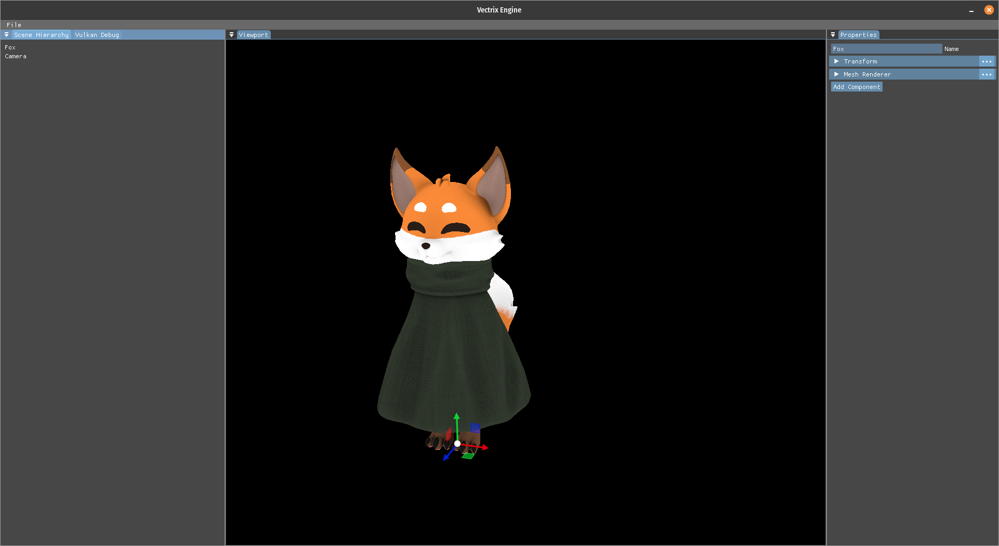

[](LICENSE) 

#### An engine built to be accessible to anyone, while letting those who want it retain full control

Current Working branch: [feature/editor](https://github.com/RX0kas/VectrixEngine/tree/feature/editor)



## Features
 - Vulkan powered rendering
 - OBJ Model Loading
 - Runtime shader compilation
 - Batch Rendering

## Prerequisites
- [CMake >=3.28](https://cmake.org/download/)
- [Lunar Vulkan SDK >=1.4.335.0](https://vulkan.lunarg.com/sdk/home)
- [Python 3](https://www.python.org/downloads/)
- Window 10/11 or Linux (Ubuntu and PopOs were the only distros tested)
- A GPU compatible with Vulkan 1.3 and SPIRV 1.6

## Installation
```bash
git clone --recurse-submodules https://github.com/RX0kas/VectrixEngine.git
cd VectrixEngine
mkdir build
cmake -S . -B ./build
cmake --build ./build
cd run
..\build\bin\Your_Platform\Debug\Sandbox.exe
```

## How to use
You can see the [Sandbox](https://github.com/RX0kas/VectrixEngine/tree/master/Sandbox/src) to better understand
#### CMakeLists.txt
```cmake
# Include your source
file(GLOB_RECURSE PROJECT_SOURCES
    Project/src/*.cpp
    Project/src/*.h
)

add_executable(Project ${PROJECT_SOURCES})

# Link your project with Vectrix
add_subdirectory(extern/VectrixEngine)

target_link_libraries(Project PRIVATE Vectrix)
target_include_directories(Project PRIVATE
    $<TARGET_PROPERTY:Vectrix,INTERFACE_INCLUDE_DIRECTORIES>
)
target_compile_definitions(Project PRIVATE
    $<TARGET_PROPERTY:Vectrix,INTERFACE_COMPILE_DEFINITIONS>
)

if(MSVC)
    target_compile_options(Project PRIVATE /utf-8)
endif()
```
## Documentation

- [API Documentation (In progress)](https://rx0kas.github.io/)


## [Roadmap](https://app.milanote.com/1WzwVV1s9muC5O?p=TjNXxqcH5oo)

## Acknowledgments
- Thanks to [TheCherno](https://github.com/TheCherno) for the API inspiration
- Folder icon from [Nik Icon](https://www.flaticon.com/fr/auteurs/nik-icon)
- File icon from [deha21](https://www.flaticon.com/fr/auteurs/deha21)
## Use of AI
AI has been used as a review tool and each modification is analyzed <br>
It was also used to create part of the documentation

## Third-party libraries
- [GLFW](https://github.com/glfw/glfw): to create the window
- [GLM](https://github.com/g-truc/glm): a mathematics library
- [Dear ImGui](https://github.com/ocornut/imgui): for the ui library
- [ShaderC](https://github.com/google/shaderc): used to compile Vulkan Shaders
- [spdlog](https://github.com/gabime/spdlog): for the logging library
- [VMA](https://github.com/GPUOpen-LibrariesAndSDKs/VulkanMemoryAllocator): Vulkan memory allocation library
- [xxHash](https://github.com/Cyan4973/xxHash): for the hashing functions
- [STB Image](https://github.com/nothings/stb/blob/master/stb_image.h): to load Textures
- [Volk](https://github.com/zeux/volk): to manage Vulkan extension
- [EnTT](https://github.com/skypjack/entt): Entity component system
- [Nativefiledialog extended](https://github.com/btzy/nativefiledialog-extended): to have the proper file dialog for each OS
---

If you like this project, feel free to give it a star!
